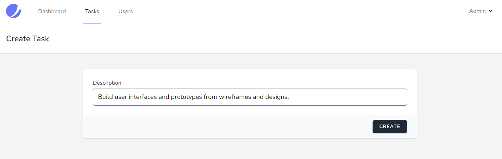

---

## Laravel Jetstream: CRUD with Role

_Laravel Jetstream is a starter kit that can use not only Auth scaffolding but additional features like Teams or two-factor authentication. This is a task management application with role and CRUD functionality._

### 💼 Role

-   Admin
-   User

### 🛠️ Features

-   Task management (view edit delete add)
-   User Management (view edit delete add)

### 📢 Permission Features

-   Admin : Task management, User Management
-   User : Task management

---

#### Login

#### Admin Dashboard

#### Task List

#### Create Task

#### User List

#### Add User

#### Edit user details

#### User Dashboard

---

### 🚩 [Reference](https://youtu.be/pyOcSEkG4Q0 "Reference")

### 💼 Package

-   [Laravel Disposable Email](https://github.com/Propaganistas/Laravel-Disposable-Email "Laravel Disposable Email")
